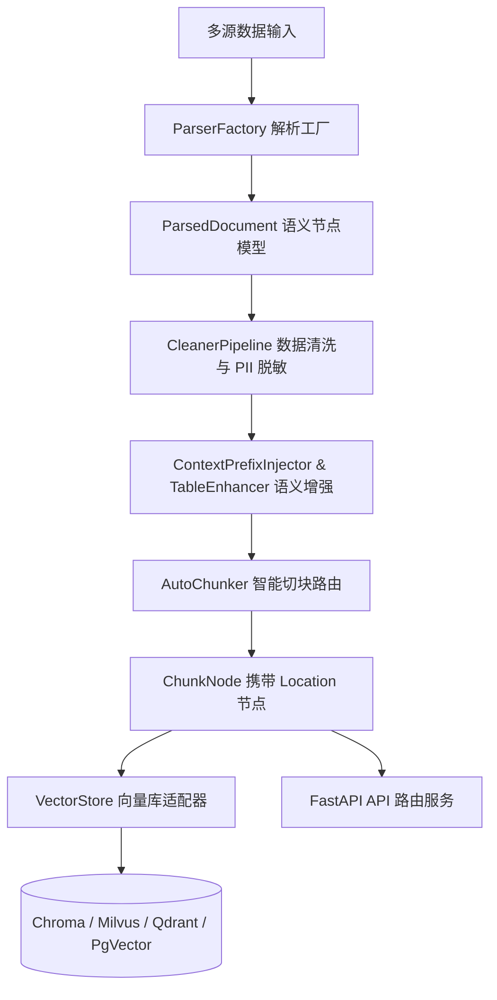

# omni-rag-engine 全模态企业级 RAG 基础设施引擎

<p align="center">
  <strong>高可用 · 全模态 · 物理几何定位 · 隐私脱敏管线 · 向量检索与 FastAPI 微服务</strong>
</p>

<p align="center">
  
  
  
  
  
</p>

---

## 📖 项目简介

**omni-rag-engine** 是一款面向企业级应用的开源全模态 RAG（检索增强生成）基础设施与后端微服务引擎。项目整合了文档解析、音视频转写、视觉图文理解、数据清洗脱敏、物理几何定位 (Location Grounding)、智能切块编排以及多向量数据库持久化，旨在为企业提供一站式、生产可用的 RAG 数据预处理与 API 服务支持。

---

## ✨ 核心特性

* 📁 **全模态多源解析 (37+ 格式)**
  支持纯文本、Markdown、Office 三大件 (`.docx`, `.xlsx`, `.pptx`)、PDF、HTML、CSV、JSON、图片 (EXIF/OCR)、音视频 (OpenAI Whisper ASR) 以及 ZIP 压缩包防解压注入扫描。

* 🎯 **精准物理/几何定位 (Location Grounding)**
  解析与切块过程全程透传物理定位元数据：
  * PDF / PPTX：归一化坐标 `bbox` + 页码 `page_number`
  * Markdown / TXT / CSV：行号 `start_line` / `end_line`
  * HTML / DOCX：DOM `selector` / XPath
  * 音视频：ASR `start_time` / `end_time` 时间戳

* 🧹 **数据清洗与隐私脱敏管线 (CleanerPipeline)**
  内置多重过滤机制，自动剔除 Unicode 不可见控制字符、规范全半角空格，并自动对手机号、身份证、邮箱等敏感隐私 (PII) 进行掩码脱敏。

* 🧩 **上下文缝合与智能切块策略**
  * 支持滑动窗口切块 (`SlidingWindowChunker`)、父子块切片 (`ParentChildChunker`) 和标题层级感知切块 (`HeaderAwareChunker`)。
  * 遵循 Anthropic Contextual Retrieval 规范，自动进行上下文大纲前缀缝合与表格结构化增强。

* 🗄️ **主流向量数据库原生适配**
  原生集成 **ChromaDB**、**Milvus**、**Qdrant**、**PGVector** 与 **FAISS**，支持平滑降级与一键切片落盘。

* ⚡ **生产级 FastAPI 微服务 & Docker 部署**
  提供开箱即用的 RESTful API 接口，并配备完整 Dockerfile 及 Docker Compose 一键启动依赖基础设施。

---

## 🏗️ 架构与数据流图



---

## 🚀 快速开始

### 方式 1：基于 `uv` 本地开发运行

#### 1. 克隆仓库与安装依赖
```bash
# 1. 克隆项目
git clone git@github.com:heiye-vn/omni-rag-engine.git
cd omni-rag-engine

# 2. 基于 uv 快速同步项目虚拟环境与依赖
uv sync
```

#### 2. 配置环境变量
```bash
# 复制配置文件模板
cp .env.example .env

# 根据需要编辑 .env 中的 API Key (如 DashScope / DeepSeek 等)
```

#### 3. 启动 FastAPI 微服务
```bash
uv run uvicorn app.main:app --reload --host 0.0.0.0 --port 8000
```
访问 http://localhost:8000/docs 即可在线测试交互式 OpenAPI (Swagger) 文档。

---

### 方式 2：使用 Docker Compose 一键容器化部署

包含 `FastAPI 服务` + `Qdrant 向量库` + `PGVector 数据库` + `Redis 缓存` 的全套基础设施：

```bash
# 一键构建后台启动
docker compose up -d --build

# 查看运行状态
docker compose ps
```

---

## 📂 项目目录结构

```text
omni-rag-engine/
├── app/
│   ├── loaders/        # 多源加载器 (本地文件/网络 URL/压缩包递归解析)
│   ├── parsers/        # 格式解析器 (PDF, DOCX, XLSX, PPTX, HTML, 音视频等)
│   ├── ocr/            # PaddleOCR 离线文字与表格识别
│   ├── captioners/     # 视觉大模型图文描述与理解引擎
│   ├── cleaners/       # CleanerPipeline 数据清洗与隐私脱敏管线
│   ├── chunkers/       # 智能切块策略 (滑动窗口/父子块/标题层级感知)
│   ├── enrichers/      # 上下文前缀缝合与表格自解释描述增强
│   ├── vectorstores/   # 向量数据库适配器 (Chroma/Milvus/Qdrant/PgVector)
│   ├── config.py       # 系统配置与环境变量自动加载器
│   ├── factory.py      # 解析器自动路由工厂
│   ├── models.py       # Pydantic 核心数据模型统一定义
│   └── main.py         # FastAPI Web 微服务入口
├── tests/              # 单元测试与集成测试套件
├── Dockerfile          # 容器构建描述文件
├── docker-compose.yml  # 多服务集群编排文件
├── pyproject.toml      # 项目依赖与构建元数据
├── AGENTS.md           # AI 助手与开发者协作规范
└── RAG_ROADMAP.md      # 功能规划与演进路线图
```

---

## 📄 开发与协作指南

在为项目提交 Pull Request 或编写新模块前，请先参阅项目内的开发规范文件：
* 📜 **架构规范与 AI 协作准则**：[AGENTS.md](AGENTS.md)
* 🗺️ **功能 roadmap 与 TODO 清单**：[RAG_ROADMAP.md](RAG_ROADMAP.md)

---

## 📝 开源协议

本项目采用 [MIT License](LICENSE) 开源协议。
